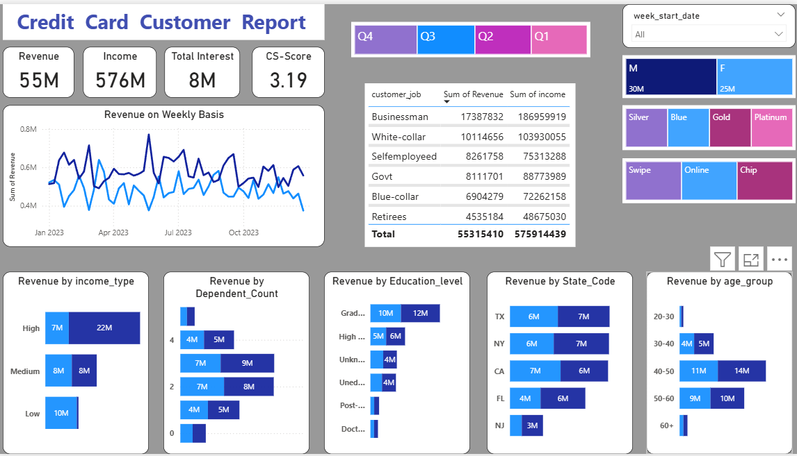
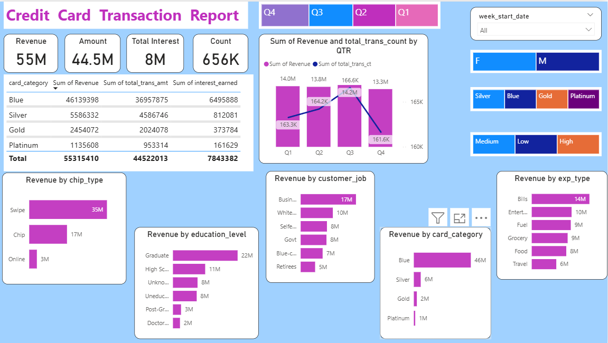

<h1>📊 Credit Card Dashboard Analysis</h1>

<h2>📌 Project Overview</h2>

This project provides an <b>interactive Power BI dashboard</b> to analyze credit card customer behavior and transactions. 
The dashboards are <b>directly connected to a PostgreSQL database</b>, ensuring real-time updates. 
Whenever new data is inserted into PostgreSQL, the dashboards are refreshed automatically to reflect the latest information. 

The goal of this project is to help financial institutions and analysts gain insights into:

<ul>
  <li>Customer demographics</li>
  <li>Spending patterns</li>
  <li>Transaction behavior</li>
  <li>Revenue & interest generation</li>
  <li>Performance by card category, job type, income type, and more</li>
</ul>

The project consists of two main dashboards:

<ol>
  <li><b>Credit Card Customer Report</b> – focuses on customer demographics, income, dependents, and revenue distribution.</li>
  <li><b>Credit Card Transaction Report</b> – focuses on transactions, revenue sources, spending categories, and card usage patterns.</li>
</ol>

<h2>📊 Dashboard 1: Credit Card Customer Report</h2>

<h3>Key Metrics</h3>
<ul>
  <li><b>Revenue:</b> 55M</li>
  <li><b>Income:</b> 576M</li>
  <li><b>Total Interest:</b> 8M</li>
  <li><b>Customer Score:</b> 3.19</li>
</ul>

<h3>Insights</h3>
<ul>
  <li>Revenue trends on a <b>weekly basis</b></li>
  <li>Revenue distribution by:
    <ul>
      <li><b>Income type</b> (High, Medium, Low)</li>
      <li><b>Dependent count</b></li>
      <li><b>Education level</b></li>
      <li><b>State</b> (TX, NY, CA, FL, NJ)</li>
      <li><b>Age group</b> (20–30, 30–40, etc.)</li>
    </ul>
  </li>
  <li>Customer segmentation by <b>gender, card type, and transaction type</b> (swipe, online, chip)</li>
  <li>Job-wise revenue: Businessmen, White-collar, Govt, Blue-collar, Retirees, etc.</li>
</ul>

<h2>📊 Dashboard 2: Credit Card Transaction Report</h2>

<h3>Key Metrics</h3>
<ul>
  <li><b>Revenue:</b> 55M</li>
  <li><b>Transaction Amount:</b> 44.5M</li>
  <li><b>Total Interest:</b> 8M</li>
  <li><b>Transaction Count:</b> 656K</li>
</ul>

<h3>Insights</h3>
<ul>
  <li>Revenue and transactions by <b>Quarter (Q1–Q4)</b></li>
  <li>Card category performance (<b>Blue, Silver, Gold, Platinum</b>)</li>
  <li>Transaction types (<b>Swipe, Chip, Online</b>)</li>
  <li>Revenue by:
    <ul>
      <li><b>Education level</b></li>
      <li><b>Customer job</b></li>
      <li><b>Expenditure type</b> (Bills, Entertainment, Fuel, Grocery, Food, Travel)</li>
    </ul>
  </li>
</ul>

<h2>🛠️ Tools & Technologies</h2>
<ul>
  <li><b>PostgreSQL</b> – Data storage & management</li>
  <li><b>Power BI</b> – Dashboard creation & visualization</li>
  <li><b>SQL</b> – Queries for data extraction & transformation</li>
  <li><b>DAX</b> – Measures & calculated columns for KPIs</li>
</ul>

<h2>🚀 How to Use</h2>
<ol>
  <li>Ensure that the <b>PostgreSQL database</b> is running with the latest data.</li>
  <li>Open the Power BI dashboard file (<code>.pbix</code>) in <b>Power BI Desktop</b>.</li>
  <li>Connect to PostgreSQL using your credentials (host, port, database, user, password).</li>
  <li>Refresh the dashboard – any new inserts in PostgreSQL will automatically reflect.</li>
  <li>Explore the dashboards using filters (time period, gender, card type, etc.).</li>
</ol>

<h2>📈 Business Use Cases</h2>
<ul>
  <li>Identify <b>high-value customers</b> based on income, spending, and card usage.</li>
  <li>Optimize <b>credit card offerings</b> (Blue, Silver, Gold, Platinum) by revenue contribution.</li>
  <li>Understand <b>spending behavior</b> by category (bills, travel, entertainment).</li>
  <li>Track <b>transaction growth</b> across quarters.</li>
  <li>Monitor <b>customer demographics</b> to design targeted campaigns.</li>
</ul>

<h2>📷 Screenshots</h2>

<b>Customer Report</b>

<b>Transaction Report</b>

<h2>✨ Future Enhancements</h2>
<ul>
  <li>Add <b>forecasting models</b> for revenue & transactions.</li>
  <li>Integrate <b>real-time API pipelines</b> to PostgreSQL.</li>
  <li>Build a <b>customer churn prediction model</b> using ML.</li>
</ul>

<h2>👨‍💻 Author</h2>

<b>Abhinav Mishra</b> 
📧 <a href="mailto:mishraabinav30@gmail.com">mishraabinav30@gmail.com</a> 
🔗 <a href="https://www.linkedin.com/in/abhinavmishra001/" target="_blank">LinkedIn</a> 
💻 <a href="https://github.com/Abhi12002" target="_blank">GitHub</a>

